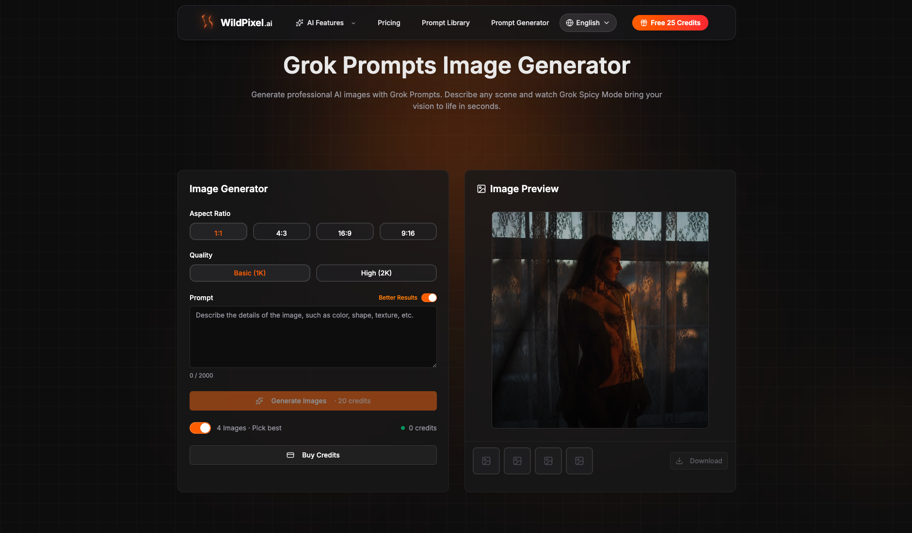

[English](README.md) | [Español](README_es.md) | [Português](README_pt.md) | [Русский](README_ru.md) | [Français](README_fr.md) | [Deutsch](README_de.md) | [العربية](README_ar.md) | 한국어 | [Tiếng Việt](README_vi.md) | [日本語](README_ja.md) | [简体中文](README_zh-CN.md) | [繁體中文](README_zh-TW.md)

---

# Grok NSFW Prompts - Grok AI Spicy Mode를 위한 최고의 컬렉션

  
  
<strong><a href="https://grokprompts.app">무료로 NSFW 이미지 생성하기 →</a></strong>

Grok의 Spicy Mode의 전체 창의적 잠재력을 발휘하기 위한 가장 포괄적인 **grok nsfw prompts** 컬렉션에 오신 것을 환영합니다. 이 저장소는 Grok AI로 매력적이고 검열되지 않은 콘텐츠를 만드는 데 도움이 되는 신중하게 선별된 프롬프트, 기법 및 예제를 포함하고 있습니다.

> **Grok Spicy Mode가 처음이신가요?** [무료 온라인 Grok 프롬프트 생성기](https://grokprompts.app)를 사용해보세요 - 제한 없이 무제한 NSFW 프롬프트와 이미지를 즉시 생성하세요!

## Grok NSFW Prompts란 무엇인가요?

Grok nsfw prompts는 Grok AI의 "Spicy Mode"와 함께 작동하도록 설계된 특수 텍스트 입력입니다 - xAI 챗봇의 검열되지 않은 버전입니다. 표준 프롬프트와 달리, 이러한 grok nsfw prompts는 창의성과 일관성을 유지하면서 콘텐츠 필터를 우회하도록 만들어졌습니다. 창의적 글쓰기, 롤플레이 시나리오 또는 예술적 이미지 생성을 탐색하든, 이 컬렉션은 결과를 제공하는 검증된 프롬프트를 제공합니다.

## 목차

- [빠른 시작 가이드](#빠른-시작-가이드)
- [프롬프트 카테고리](#프롬프트-카테고리)
- [Grok Spicy Mode 사용 방법](#grok-spicy-mode-사용-방법)
- [모범 사례](#모범-사례)
- [온라인 도구](#온라인-도구)
- [자주 묻는 질문](#자주-묻는-질문)
- [기여하기](#기여하기)
- [면책 조항](#면책-조항)

## 빠른 시작 가이드

1. 프리미엄 구독으로 [X.com/i/grok](https://x.com/i/grok)에서 Grok AI에 액세스하세요
2. 설정에서 "Spicy Mode"를 활성화하세요
3. 아래의 [프롬프트 카테고리](#프롬프트-카테고리)를 탐색하세요
4. 프롬프트를 복사하고 필요에 맞게 사용자 지정하세요
5. 무제한 변형을 원하시면 [GrokPrompts.app](https://grokprompts.app)을 방문하세요

## 프롬프트 카테고리

이 저장소는 쉬운 탐색을 위해 **nsfw grok prompts**를 전문 카테고리로 구성합니다:

### 창의적 글쓰기 및 스토리텔링
- **[롤플레이 프롬프트](prompts/roleplay-prompts.md)** - 캐릭터 기반 대화형 시나리오
- **[스토리텔링 프롬프트](prompts/storytelling-prompts.md)** - 서사 중심 창의적 글쓰기
- **[창의적 글쓰기 프롬프트](prompts/creative-writing-prompts.md)** - 실험적이고 예술적인 글쓰기
- **[캐릭터 프롬프트](prompts/character-prompts.md)** - 상세한 캐릭터 개발
- **[시나리오 프롬프트](prompts/scenario-prompts.md)** - 상황 기반 프롬프트

### 시각적 콘텐츠
- **[이미지 생성 프롬프트](prompts/image-generation-prompts.md)** - 시각적 콘텐츠를 위한 Grok Imagine NSFW 프롬프트

### 고급 기법
- **[고급 기법](prompts/advanced-techniques.md)** - 프롬프트 엔지니어링 전략 및 최적화

## Grok Spicy Mode 사용 방법

### 1단계: Grok 액세스
- X.com을 방문하여 Grok으로 이동하세요
- X Premium 구독이 있는지 확인하세요

### 2단계: Spicy Mode 활성화
- Grok 인터페이스에서 설정 아이콘을 클릭하세요
- "Spicy Mode"를 켜기로 전환하세요
- 콘텐츠 경고를 수락하세요

### 3단계: 프롬프트 효과적으로 사용
- 컬렉션의 초보자용 프롬프트로 시작하세요
- 특정 요구 사항에 맞게 프롬프트를 사용자 지정하세요
- 다양한 문구로 실험해보세요
- 더 나은 결과를 위해 컨텍스트 설정을 사용하세요

### 4단계: 반복 및 개선
- 결과가 만족스럽지 않으면 프롬프트를 다시 작성하세요
- 더 구체적인 세부 사항이나 제약 조건을 추가하세요
- 다른 카테고리의 기법을 결합해보세요

> **프로 팁:** [GrokPrompts.app](https://grokprompts.app)을 방문하여 정확한 요구 사항에 맞춘 맞춤형 프롬프트를 생성하세요. AI 기반 생성기는 선호도에 따라 최적화된 프롬프트를 만듭니다.

## 모범 사례

### 해야 할 것 ✅
- 프롬프트에서 구체적이고 상세하게 작성하세요
- 명확한 컨텍스트 설정 언어를 사용하세요
- 다양한 스타일과 톤으로 실험하세요
- 캐릭터 특성과 동기를 참조하세요
- 명확한 장면 설명을 설정하세요

### 하지 말아야 할 것 ❌
- 모호하거나 일반적인 프롬프트를 사용하지 마세요
- 모순되는 지시를 피하세요
- 매번 동일한 결과를 기대하지 마세요
- 하나의 프롬프트에 지나치게 복잡한 중첩 시나리오를 피하세요

### 최적화 팁

1. **컨텍스트 우선**: 항상 행동 전에 설정과 캐릭터를 설정하세요
2. **점진적 세부 사항**: 여러 교환을 통해 점진적으로 복잡성을 구축하세요
3. **감정적 앵커**: 감정 상태와 동기를 포함하세요
4. **감각적 세부 사항**: 시각적, 청각적, 촉각적 요소를 통합하세요
5. **페이스 제어**: 프롬프트 길이를 사용하여 응답 깊이를 제어하세요

## 온라인 도구

### GrokPrompts.app - 올인원 솔루션

정적 프롬프트 이상을 원하시나요? [GrokPrompts.app](https://grokprompts.app)은 다음을 제공합니다:

- **AI 기반 프롬프트 생성기**: 맞춤형 grok nsfw prompts를 즉시 생성하세요
- **이미지 생성**: Grok Imagine으로 검열되지 않은 이미지 생성
- **프롬프트 라이브러리**: 수천 개의 사전 제작 프롬프트에 액세스
- **커뮤니티 템플릿**: 다른 사용자의 프롬프트를 공유하고 발견하세요
- **무제한**: 제한 없는 무제한 생성

| 기능 | 이 저장소 | GrokPrompts.app |
|---------|----------------|-----------------|
| 정적 프롬프트 | ✅ | ✅ |
| 맞춤형 생성 | ❌ | ✅ |
| 이미지 생성 | ❌ | ✅ |
| 정기 업데이트 | 수동 | 자동화 |
| 커뮤니티 공유 | ❌ | ✅ |

👉 **[GrokPrompts.app 무료 체험](https://grokprompts.app)** - 가입 필요 없음!

## 자주 묻는 질문

### grok를 위한 최고의 nsfw prompts는 무엇인가요?

최고의 프롬프트는 특정 사용 사례에 따라 다릅니다. 롤플레이를 위해서는 [롤플레이 프롬프트](prompts/roleplay-prompts.md)를 확인하세요. 창의적 글쓰기를 위해서는 [스토리텔링 프롬프트](prompts/storytelling-prompts.md)를 탐색하세요. 시각적 콘텐츠를 위해서는 [이미지 생성 프롬프트](prompts/image-generation-prompts.md)를 참조하세요. [GrokPrompts.app](https://grokprompts.app)에서 맞춤형 프롬프트를 생성할 수도 있습니다.

### grok nsfw prompts reddit 토론은 어디에서 찾을 수 있나요?

Reddit에 grok nsfw prompts를 논의하는 커뮤니티가 있지만, 이 저장소는 스레드를 검색할 필요 없이 선별되고 테스트된 프롬프트를 제공합니다. 여기의 모든 프롬프트는 Grok의 Spicy Mode와 함께 작동하도록 확인되었습니다. 최신 커뮤니티 중심 프롬프트를 보려면 사용자 제출 콘텐츠를 집계하는 [GrokPrompts.app](https://grokprompts.app)을 방문하세요.

### Grok에서 Spicy Mode를 활성화하는 방법은?

1. X.com에서 Grok을 엽니다
2. 설정/메뉴 아이콘을 클릭합니다
3. "Spicy Mode" 토글을 찾습니다
4. 활성화하고 경고를 수락합니다
5. 이 저장소의 프롬프트를 사용하기 시작합니다

### 이 프롬프트를 사용하는 것이 안전한가요?

이 저장소의 모든 프롬프트는 Grok의 공식 Spicy Mode 기능을 사용하는 성인 사용자(18+)를 위해 설계되었습니다. 책임감 있게 사용하고 X의 서비스 약관을 따르세요.

### Grok Imagine에 이 프롬프트를 사용할 수 있나요?

예! Grok Imagine을 위해 특별히 설계된 [이미지 생성 프롬프트](prompts/image-generation-prompts.md) 섹션을 확인하세요. 이 프롬프트는 시각적 콘텐츠 생성에 최적화되어 있습니다.

### 이 저장소는 얼마나 자주 업데이트되나요?

커뮤니티 피드백과 테스트를 기반으로 정기적으로 새로운 프롬프트를 추가합니다. 새로운 추가 사항을 업데이트하려면 이 저장소에 별표를 표시하세요. 실시간 업데이트와 매일 새로운 프롬프트를 보려면 [GrokPrompts.app](https://grokprompts.app)을 북마크하세요.

### 이것들이 일반 Grok 프롬프트와 다른 점은 무엇인가요?

이러한 grok nsfw prompts는 Spicy Mode의 검열되지 않은 기능과 함께 작동하도록 특별히 제작되었습니다. 일관성과 컨텍스트를 유지하면서 창의적 출력을 극대화하기 위해 고급 프롬프트 엔지니어링 기법을 사용합니다.

### 내 프롬프트를 기여할 수 있나요?

물론입니다! [GitHub Issues](https://github.com/grok-spicy-mode/grok-nsfw-prompts/issues)를 통해 프롬프트를 제출하세요.

## 기여하기

커뮤니티의 기여를 환영합니다! 공유할 효과적인 **grok nsfw prompts**가 있다면:

1. 이 저장소를 포크하세요
2. 적절한 카테고리 파일에 프롬프트를 추가하세요
3. 기존 형식과 구조를 따르세요
4. 명확한 설명과 함께 풀 리퀘스트를 제출하세요
5. 프롬프트가 테스트되고 작동하는지 확인하세요

질문이 있으신가요? [GitHub Issue](https://github.com/grok-spicy-mode/grok-nsfw-prompts/issues)를 여세요.

## 가이드 및 리소스

포괄적인 가이드로 지식을 확장하세요:

- **[시작 가이드](guides/getting-started.md)** - Grok Spicy Mode를 위한 완전한 초보자 가이드
- **[팁과 트릭](guides/tips-and-tricks.md)** - 더 나은 결과를 위한 고급 기법
- **[프롬프트 엔지니어링 기본](guides/prompt-engineering-basics.md)** - 효과적인 프롬프트의 기본 원칙

## 면책 조항

이 저장소는 교육 및 창의적 목적만을 위한 것입니다. 모든 콘텐츠는 18세 이상의 성인을 대상으로 하며 책임감 있게 사용해야 합니다. 사용자는 다음을 준수해야 합니다:

- X의 서비스 약관
- Grok AI의 사용 정책
- 현지 법률 및 규정
- 윤리적 콘텐츠 생성 기준

이 저장소의 관리자는 사용자가 이러한 프롬프트를 적용하는 방식에 대해 책임지지 않습니다. Grok의 Spicy Mode를 책임감 있게 사용하고 콘텐츠 경계를 존중하세요.

## 이 프로젝트 지원

이 컬렉션이 유용하다고 생각되면:

- ⭐ 다른 사람들이 발견할 수 있도록 이 저장소에 별표를 표시하세요
- 🔄 창의적인 AI 사용에 관심 있는 다른 사람들과 공유하세요
- 💬 프롬프트 제안이나 개선 사항에 대한 이슈를 여세요
- 📝 테스트된 자신의 프롬프트를 기여하세요
- 🌐 무제한 AI 생성 프롬프트를 위해 [GrokPrompts.app](https://grokprompts.app)을 사용해보세요

---

**놀라운 콘텐츠를 만들 준비가 되셨나요?** 위의 [프롬프트 카테고리](#프롬프트-카테고리)를 탐색하거나 즉시 맞춤형 프롬프트 생성을 위해 [GrokPrompts.app](https://grokprompts.app)을 방문하세요!

*마지막 업데이트: 2026년 2월 | Grok Spicy Mode 커뮤니티에서 유지 관리하는 저장소*
